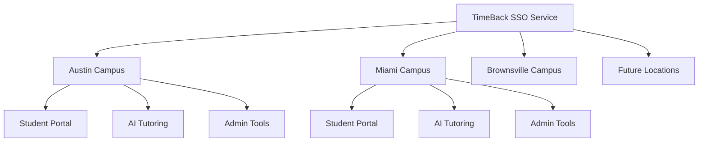

## TimeBack SSO Overview

TimeBack's Single Sign-On (SSO) system provides seamless authentication across all Alpha School applications and services. Built specifically for educational environments, it ensures students, educators, and administrators can access all necessary tools without multiple login prompts.

## Why SSO Matters for Alpha School

#### Seamless Educational Experience
- **No Learning Interruptions**: Students stay focused on learning rather than managing credentials
- **Instant Access**: Quick transitions between educational tools and platforms
- **Reduced Cognitive Load**: Eliminates password fatigue and login friction

#### Enhanced Security
- **Centralized Authentication**: Single point of security control and monitoring
- **Device Fingerprinting**: Advanced security through unique device identification
- **Session Management**: Intelligent session handling across multiple domains

#### Administrative Efficiency
- **Simplified User Management**: Single identity source for all Alpha School services
- **Audit Trail**: Comprehensive logging of authentication events
- **Reduced Support Burden**: Fewer password reset requests and login issues

## How TimeBack SSO Works

#### Device Fingerprinting Technology

TimeBack SSO uses advanced device fingerprinting to create unique identifiers for each device without requiring cookies or shared storage:

```typescript
// Device fingerprint components
const fingerprint = {
  userAgent: navigator.userAgent,
  language: navigator.language,
  screenResolution: `${screen.width}x${screen.height}`,
  colorDepth: screen.colorDepth,
  timezone: new Date().getTimezoneOffset(),
  hardwareConcurrency: navigator.hardwareConcurrency,
  canvasFingerprint: generateCanvasFingerprint()
}
```

#### Cross-Domain Authentication Flow

<Steps>
  <Step title="Initial Login">
    User authenticates on any Alpha School domain (e.g., `student.alpha.school`)
  </Step>
  <Step title="Session Registration">
    Device fingerprint and domain are registered with TimeBack's authentication service
  </Step>
  <Step title="Cross-Domain Access">
    When accessing another domain (e.g., `tutoring.alpha.school`), the system checks for existing sessions
  </Step>
  <Step title="Automatic Authentication">
    If a valid session exists, a new JWT token is issued automatically
  </Step>
</Steps>

#### Session Management

TimeBack SSO maintains intelligent session management:

- **Active Session Tracking**: Real-time monitoring of user sessions across domains
- **Device-Based Security**: Each device maintains its own authentication state
- **Graceful Expiration**: Automatic token refresh and session extension
- **Selective Logout**: Option to logout from current device or all devices

## SSO Integration Points

### Alpha School Applications

TimeBack SSO integrates with all major Alpha School systems:

- **Learning Management System**: Student coursework and progress tracking
- **AI Tutoring Platform**: 1:1 personalized tutoring sessions  
- **Assessment Tools**: Testing and evaluation systems
- **Progress Analytics**: Parent and educator dashboards
- **Campus Management**: Administrative and operational tools

### Multi-Campus Support

SSO works seamlessly across all Alpha School locations:



### Role-Based Access

Different user types have tailored experiences:

#### Students
- Access to learning platforms and progress tracking
- Simplified authentication for educational tools
- Parental oversight capabilities

#### Alpha Guides (Educators)
- Administrative tools and student management
- Curriculum and assessment platforms
- Analytics and reporting dashboards

#### Administrators
- Campus management systems
- Staff coordination tools
- System administration interfaces

#### Parents/Guardians
- Student progress monitoring
- Communication platforms
- Scheduling and coordination tools

## Security & Privacy

### Advanced Authentication Features

- **JWT Token Management**: Secure, short-lived tokens with automatic refresh
- **Device Binding**: Tokens are bound to specific device fingerprints
- **Domain Validation**: Strict domain whitelisting for security
- **Session Isolation**: Each campus can maintain independent security policies

### Educational Privacy Compliance

- **COPPA Compliance**: Special protections for student data under 13
- **No Personal Data in Fingerprints**: Device identification without storing personal information
- **Data Minimization**: Only necessary authentication and time optimization data is collected
- **Audit and Monitoring**: Complete logs for compliance and security

## SSO Benefits

### For Users
- **Frictionless Experience**: One login for all Alpha School services
- **Increased Productivity**: More time spent on learning, less on authentication
- **Enhanced Security**: Advanced protection without user complexity
- **Cross-Device Consistency**: Same experience on all devices

### For Development Teams
- **Standardized Authentication**: Consistent implementation across all applications
- **Simplified Integration**: Easy-to-use SDK and documentation
- **Reduced Complexity**: No need to implement custom authentication
- **Developer-Friendly**: TypeScript support and comprehensive APIs

## Technical Architecture

### Microservices Design

TimeBack SSO operates as a distributed system:

- **Authentication Service**: Core login and token management
- **Session Registry**: Cross-domain session tracking
- **Device Registry**: Fingerprint management and validation
- **Audit Service**: Logging and monitoring

### High Availability

- **Multi-Region Deployment**: Redundancy across geographic locations
- **Failover Protection**: Automatic service recovery
- **Load Balancing**: Distributed request handling
- **99.9% Uptime SLA**: Guaranteed availability for education

## Implementation Benefits

TimeBack SSO represents a significant advancement in educational technology authentication, providing the security and convenience necessary for Alpha School's innovative learning environment across all current and future campus locations.