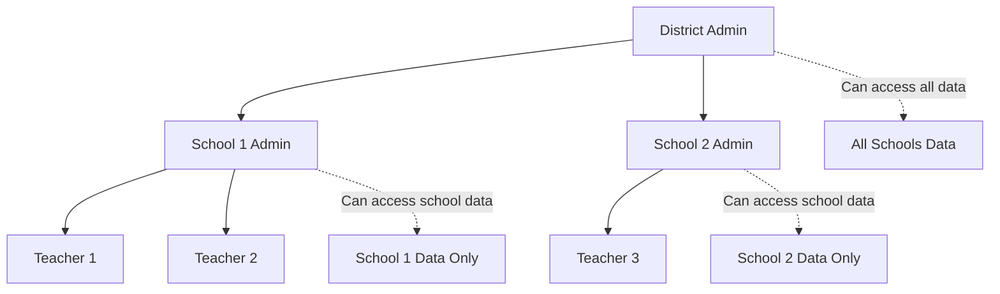

## Multi-Organizational Architecture

TimeBack's organizational architecture supports complex educational hierarchies from individual classrooms to large multi-campus districts, providing scalable management and data isolation while maintaining unified analytics and reporting.

## Organizational Hierarchy

### District Level
Top-tier organizational units managing multiple schools:

```typescript
interface District {
  id: string;
  name: string;
  type: "district";
  status: "active" | "tobedeleted";
  identifier?: string; // State or federal ID
  metadata: {
    superintendent: string;
    studentCount: number;
    schoolCount: number;
    establishedYear: number;
    accreditation: string[];
    policies: DistrictPolicy[];
  };
}
```

**District Capabilities:**
- **Multi-School Management**: Centralized oversight of all campuses
- **District-Wide Policies**: Unified grading scales, calendar, and procedures
- **Consolidated Reporting**: Aggregate analytics across all schools
- **Resource Sharing**: Coordinated purchasing and license management
- **Staff Management**: District-level administrator and teacher assignments

### School Level
Individual campus entities with local autonomy:

```typescript
interface School {
  id: string;
  name: string;
  type: "school";
  parentId: string; // District ID
  status: "active" | "tobedeleted";
  identifier?: string; // NCES ID or state identifier
  metadata: {
    principal: string;
    studentCapacity: number;
    currentEnrollment: number;
    gradeRange: string; // "K-5", "6-8", "9-12"
    schoolType: "elementary" | "middle" | "high" | "charter" | "private";
    address: Address;
    contact: ContactInfo;
    specialPrograms: string[];
  };
}
```

**School Capabilities:**
- **Campus Management**: Local administrative control and customization
- **Grade-Level Organization**: Age-appropriate groupings and curricula
- **Faculty Management**: School-specific teacher and staff assignments
- **Local Policies**: School-specific rules within district guidelines
- **Parent Communication**: Campus-focused family engagement

### Department Level (Optional)
Subject-specific organizational units within schools:

```typescript
interface Department {
  id: string;
  name: string;
  type: "department";
  parentId: string; // School ID
  subject: string; // "mathematics", "science", "english"
  headOfDepartment: string;
  teacherIds: string[];
  budget?: number;
  goals: DepartmentGoal[];
}
```

## Data Isolation and Security

### Multi-Tenancy Architecture
Each organizational unit maintains data isolation:

```typescript
interface OrganizationalContext {
  orgId: string;
  orgType: "district" | "school" | "department";
  accessLevel: "read" | "write" | "admin";
  dataScope: string[]; // Child organization IDs
  permissions: Permission[];
}
```

### Permission Inheritance
Rights flow down the organizational hierarchy:



### Data Access Patterns
```sql
-- Example: Teacher can only see their school's data
SELECT * FROM students 
WHERE school_id IN (
  SELECT school_id FROM teacher_assignments 
  WHERE teacher_id = :current_user_id
);

-- Example: District admin can see all schools
SELECT * FROM schools 
WHERE district_id = :user_district_id;
```

## Role-Based Access Control

### Organizational Roles
Different roles have specific access patterns:

```typescript
type OrganizationalRole = 
  | "district_admin"
  | "district_staff"
  | "school_admin" 
  | "department_head"
  | "teacher"
  | "support_staff"
  | "student"
  | "parent";

interface RolePermissions {
  role: OrganizationalRole;
  scope: "district" | "school" | "department" | "class";
  permissions: {
    students: ("read" | "write" | "admin")[];
    grades: ("read" | "write" | "admin")[];
    resources: ("read" | "write" | "admin")[];
    reports: ("read" | "write" | "admin")[];
    settings: ("read" | "write" | "admin")[];
  };
}
```

### Role Examples

#### District Administrator
- **Full Access**: All schools, all data, all settings
- **Responsibilities**: District-wide policies, budget allocation, compliance
- **Capabilities**: Cross-school reporting, resource allocation, staff management

#### School Principal
- **School Scope**: Single school, all departments and classes
- **Responsibilities**: Campus management, local policies, staff supervision
- **Capabilities**: School-wide analytics, teacher evaluation, parent communication

#### Department Head
- **Department Scope**: Single subject area across grade levels
- **Responsibilities**: Curriculum oversight, teacher mentoring, resource management
- **Capabilities**: Subject-specific analytics, teacher collaboration, standards alignment

#### Teacher
- **Class Scope**: Assigned classes and enrolled students
- **Responsibilities**: Instruction, assessment, student progress
- **Capabilities**: Gradebook management, student analytics, parent communication

## Campus Management Features

### Multi-Campus Coordination
TimeBack supports Alpha School's multi-campus architecture:

```typescript
interface CampusConfiguration {
  campusId: string;
  name: string;
  location: {
    city: string;
    state: string;
    timezone: string;
  };
  academicCalendar: {
    schoolYear: number;
    startDate: Date;
    endDate: Date;
    holidaySchedule: Holiday[];
    gradingPeriods: GradingPeriod[];
  };
  localSettings: {
    gradingScale: GradingScale;
    attendancePolicy: AttendancePolicy;
    disciplinePolicy: DisciplinePolicy;
    communicationPreferences: CommunicationSettings;
  };
}
```

### Unified Analytics
Cross-campus reporting and analytics:

```typescript
interface DistrictAnalytics {
  timeframe: DateRange;
  campuses: CampusMetrics[];
  aggregated: {
    totalStudents: number;
    averageGPA: number;
    attendanceRate: number;
    masteryDistribution: MasteryLevel[];
    timeOptimizationGains: number;
  };
  comparisons: CampusComparison[];
  trends: TrendAnalysis[];
}
```

## Implementation Examples

### Cross-Campus Student Transfer
```typescript
async function transferStudent(
  studentId: string, 
  fromSchoolId: string, 
  toSchoolId: string
) {
  // Verify both schools in same district
  const schools = await validateSameDistrict(fromSchoolId, toSchoolId);
  
  // Transfer enrollments
  await db.transaction(async (tx) => {
    // End current enrollments
    await tx.update(enrollments)
      .set({ status: "tobedeleted", endDate: new Date() })
      .where(eq(enrollments.studentId, studentId));
    
    // Create new enrollments at target school
    const newClasses = await getEquivalentClasses(fromSchoolId, toSchoolId);
    await tx.insert(enrollments).values(
      newClasses.map(classId => ({
        studentId,
        classId,
        schoolId: toSchoolId,
        role: "student",
        beginDate: new Date(),
        status: "active"
      }))
    );
    
    // Transfer academic records
    await transferGradeHistory(studentId, fromSchoolId, toSchoolId, tx);
  });
}
```

### District-Wide Resource Allocation
```typescript
async function allocateDistrictResource(
  resourceId: string,
  allocationPlan: ResourceAllocation[]
) {
  // Check district-level permissions
  await verifyDistrictAdmin(currentUser);
  
  // Validate resource availability
  const resource = await getResource(resourceId);
  const totalLicenses = resource.metadata.maxLicenses;
  const requestedLicenses = allocationPlan.reduce((sum, plan) => sum + plan.licenseCount, 0);
  
  if (requestedLicenses > totalLicenses) {
    throw new Error("Insufficient licenses available");
  }
  
  // Allocate to schools
  for (const allocation of allocationPlan) {
    await createSchoolResourceAllocation({
      schoolId: allocation.schoolId,
      resourceId,
      licenseCount: allocation.licenseCount,
      startDate: allocation.startDate,
      endDate: allocation.endDate
    });
  }
}
```

### Hierarchical Reporting
```typescript
async function generateHierarchicalReport(
  orgId: string,
  reportType: string,
  includeSubOrgs: boolean = true
) {
  const organization = await getOrganization(orgId);
  let scope = [orgId];
  
  if (includeSubOrgs) {
    const children = await getChildOrganizations(orgId);
    scope = [...scope, ...children.map(c => c.id)];
  }
  
  const data = await generateReportData(reportType, scope);
  
  return {
    organization: organization.name,
    scope: scope.length > 1 ? "hierarchical" : "single",
    generated: new Date(),
    data: data,
    summary: generateSummaryStatistics(data),
    breakdown: generateHierarchicalBreakdown(data, scope)
  };
}
```

## API Architecture

### Organization-Scoped Endpoints
```typescript
// Get organizations user can access
GET /api/organizations

// Get specific organization details
GET /api/organizations/{orgId}

// Get child organizations
GET /api/organizations/{orgId}/children

// Organization-scoped data access
GET /api/organizations/{orgId}/students
GET /api/organizations/{orgId}/classes
GET /api/organizations/{orgId}/analytics

// Cross-organizational operations (district admin only)
POST /api/organizations/{districtId}/transfer-student
POST /api/organizations/{districtId}/allocate-resources
```

### Context-Aware Authentication
```typescript
interface AuthContext {
  userId: string;
  role: OrganizationalRole;
  primaryOrgId: string;
  accessibleOrgIds: string[];
  permissions: Permission[];
}

// Middleware to enforce organizational boundaries
app.use('/api/organizations/:orgId/*', async (req, res, next) => {
  const { orgId } = req.params;
  const userContext = await getUserContext(req.user.id);
  
  if (!userContext.accessibleOrgIds.includes(orgId)) {
    return res.status(403).json({ error: "Access denied to organization" });
  }
  
  req.orgContext = {
    orgId,
    userRole: userContext.role,
    permissions: userContext.permissions
  };
  
  next();
});
```

## Benefits

### For Districts
- **Centralized Oversight**: Unified view of all schools and students
- **Policy Consistency**: District-wide standards with local flexibility
- **Resource Optimization**: Efficient allocation across campuses
- **Compliance Management**: Automated monitoring and reporting

### For Schools
- **Local Autonomy**: Campus-specific customization within district guidelines
- **Data Privacy**: School-level data isolation and security
- **Collaborative Insights**: Share best practices with other campuses
- **Seamless Transfers**: Easy student and staff movement between schools

### For Teachers
- **Familiar Interface**: Consistent experience across different schools
- **Professional Growth**: Access to district-wide professional development
- **Resource Access**: Shared educational materials and best practices
- **Career Mobility**: Simplified transitions between campuses

### For Students and Families
- **Continuity**: Seamless experience when changing schools
- **Transparency**: Clear understanding of district and school policies
- **Equal Access**: Consistent quality across all campuses
- **Progress Tracking**: Continuous academic record throughout district

TimeBack's multi-organizational architecture provides the scalability and flexibility needed to support complex educational environments while maintaining security, privacy, and educational effectiveness at every level.